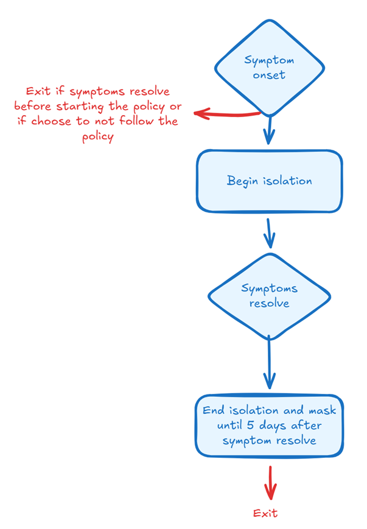
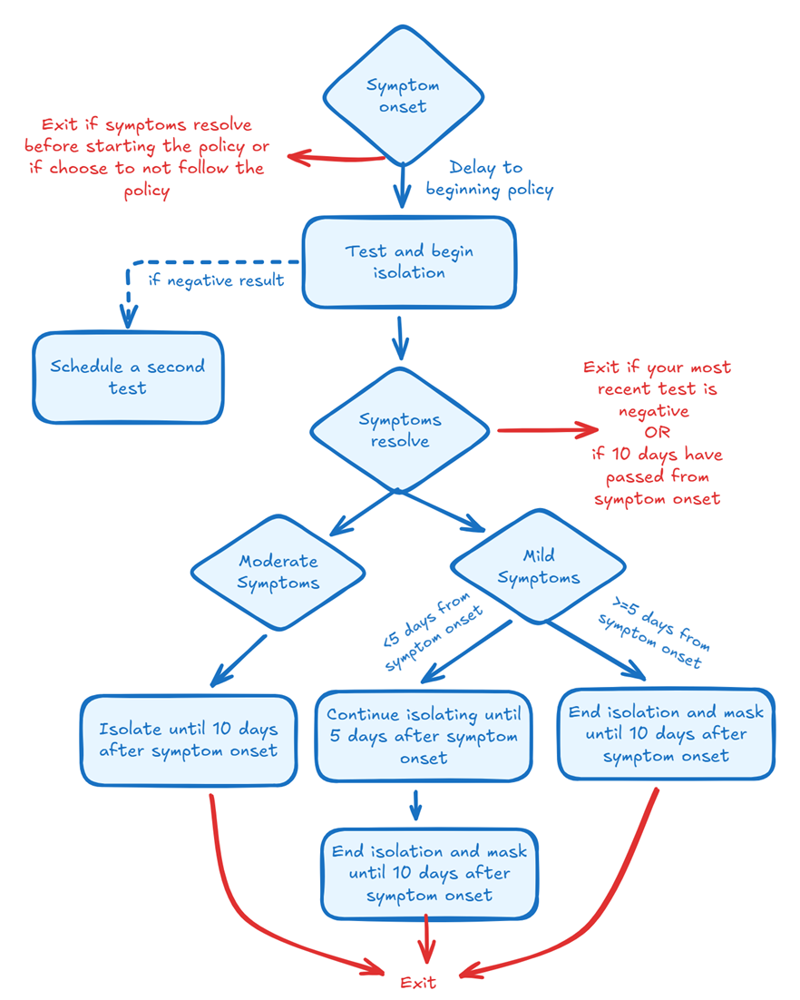

# Intervention policies
The goal of the `ixa-epi-isolation` model is to compare the updated and previous COVID-19 isolation guidance policies. We refer to the updated isolation guidance as broader pan-respiratory guidance policy recommended for COVID-19 in March 2024, and the previous isolation guidance policy as the policy in place immediately before the updated isolation guidance policy. These policies are implemented as an optional `Policies` type with two possible values:`UpdateIsolationGuidance` and `PreviousIsolationGuidance`.

## Modeling interventions
Before discussing the implementation of the policies, we must discuss the interventions which comprise the policy.

### Isolation
Isolation is implemented as an itinerary modifier that reduces the number of contacts an individual has. It is implemented as a boolean person property with default `IsolationStatus = false`. When an individual starts isolating (i.e., `IsolationStatus = true`), their itinerary is modified, limiting it to just be active in their home. When an individual leaves isolation, their default activity is reactivated. This itinerary modification would mean that the isolated individual would only be eligible to transmit disease in the household. See [settings documentation](settings.md) for more information on itinerary modifiers.

### Facemasks
Facemasks are implemented as a transmission modifier and reduce an individual's infectiousness. It is implemented as a boolean person property with default `MaskingStatus = false`. When masking (i.e., `MaskingStatus = true`), an individual's infectiousness is scaled down by facemask `facemask_efficacy` defined in the `FacemaskParameters` struct. See [transmission documentation](transmission.md) for more details about transmission modifiers.

## Updated Isolation Guidance
The updated isolation guidance can be found [here](https://www.cdc.gov/respiratory-viruses/prevention/precautions-when-sick.html). The policy is parameterized by the follow elements:
- `policy_adherence` the proportion of individual that follow the policy when symptomatic
- `post_isolation_duration` the duration an individual follows post-isolation precautions
- `isolation_delay_period` mean of the exponential distribution which generates an individual's delay from symptom onset to beginning isolation

The updated isolation guidance implementation is outlined in the figure below. At symptom onset, individuals are randomly selected to begin the policy with probability defined by `policy_adherence`. If they do, a plan is created to begin isolating the individual after a delay period which is sampled from an exponential distribution with mean `isolation_delay_period`. The individual then isolates until their symptoms resolve. It is assumed if an individual's symptoms resolve before they begin isolating that they exit the policy and take no further action. Once their symptoms resolve, the individual immediately begins following post-isolation precautions, which in this model is strictly masking. A plan is created to end masking after `post_isolation_duration` days.

    

## Previous Isolation Guidance
The previous isolation guidance can be found [here](https://archive.cdc.gov/www_cdc_gov/coronavirus/2019-ncov/your-health/isolation.html). The policy is parameterized by the following elements:
- `overall_policy_duration` the minimum duration from symptom onset of the policy if the individual has a positive test result
- `mild_symptom_isolation_duration` the minimum required duration of isolation for individuals with mild symptoms
- `moderate_symptom_isolation_duration` the minimum required duration of isolation for individuals with moderate symptoms
- `delay_to_retest` the delay between an individual's first negative test and the subsequent retest
- `policy_adherence` probability an individual follows the isolation guidance policy
- `isolation_delay_period` delay from symptom onset to when an individual starts following the isolation guidance policy
- `test_sensitivity` sensitivity of the test used to determine if an individual is infected

The previous isolation guidance implementation is outlined in the figure below. At symptom onset, individuals are randomly selected to begin the policy with probability defined by `policy_adherence`. If they do, a plan is created to test and begin isolating the individual after a delay period which is sampled from an exponential distribution with mean `isolation_delay_period`. If the test result is negative they are schedule to retest after `delay_to_retest` days. The probability a test is successful conditional on the individual being infectious is `test_sensitivity`. Regardless of the individual's test results, they isolate until their symptoms resolve. When their symptoms resolve, depending on their symptom severity and test results a number of possible actions could be taken which are enumerated below:
- Mild symptoms and latest test is positive:
    - If `mild_symptom_isolation_duration` days have passed from symptom onset the individual ends isolation and begins post-isolation precautions until `overall_policy_duration` have passed.
    - If symptoms resolve before `mild_symptom_isolation_duration` days from symptom onset, they remain isolating until `mild_symptom_isolation_duration` and then follow post-isolation precautions until `overall_policy_duration` have passed.
    - If the symptoms resolve after `overall_policy_duration` days from symptom onset the person exits the policy immediately and does not do any post isolation precautions.
- Moderate symptoms and latest test is positive:
    - If `moderate_symptom_isolation_duration` days have passed from symptom onset the individual ends isolation and begins post-isolation precautions until `overall_policy_duration` have passed.
    - If symptoms resolve before `moderate_symptom_isolation_duration` days from symptom onset, they remain isolating until `moderate_symptom_isolation_duration` and then follow post-isolation precautions until `overall_policy_duration` have passed.
    - If the symptoms resolve after `overall_policy_duration` days from symptom onset the person exits the policy immediately and does not do any post isolation precautions.
- Mild symptoms and latest test is negative: the individual is removed from isolation and exits the policy.
- Moderate symptoms and latest test is negative: the individual is removed from isolation and exits the policy.

Several assumptions are made in this implementation which are listed below:
- If an individual's symptoms resolve before their first test/they begin isolating, they will exit the policy and take no further action.
- If an individual's symptoms resolve before their second test, the result of their first test will be used to determine their next steps in the policy.
- Symptom categories 1 and 2 are regarded as moderate symptoms and categories 3 and 4 are mild symptoms.

    

