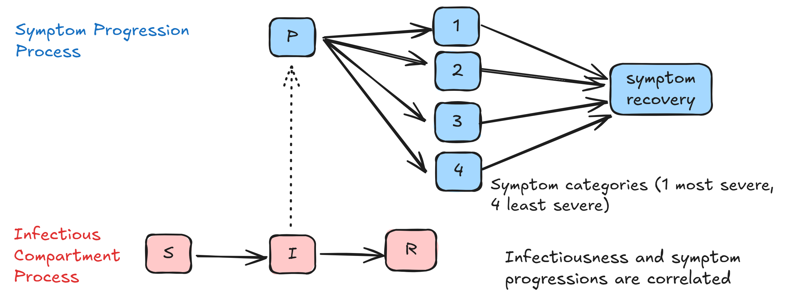

# Symptom Progression
The symptom progression implementation is designed to model symptoms in the same way as the [individual analysis of isolation guidelines](https://www.cdc.gov/cfa-behind-the-model/php/data-research/covid-isolation/index.html). In this work, four categories of symptom severity are defined as follows:
- Category 1: Moderate. Persons who ever reported shortness of breath
- Category 2: Mild with fever or body aches
- Category 3: Mild respiratory symptoms without fever or body aches
- Category 4: Mild with non-specific symptoms

The flow between presymptomatic, symptomatic and symptom recovery is shown in the image below. An individual is stochastically assigned to be symptomatic with probability $1-$ `proportion_asymptomatic` and the symptom progression is triggered to begin when they become infectious. Asymptomatic individuals are modeled as those without a symptom progression rather than having an explicit symptom progression.

    

The transition between symptom states and the durations are informed by symptom progression data defined in an empirical symptom progression file. Both of these topics are discussed below.

## Symptom Progressions Connection to Infectiousness
The model uses the same data described in the individual level analysis of the isolation guidance which captured viral load and symptom progressions of individuals over their infection. When empirical infectiousness rate functions are used, they are linked to symptom progression via the `id` column in the empirical files. A progression is randomly assigned to an individual at the time of the infection and the corresponding progression is retrieved at the time symptoms begin.

Each progression is at the individual-level and includes the symptom category, incubation period, and distribution parameters for the duration of symptoms. The duration of symptoms is assumed to be a Weibull distribution and the shape, scale, and upper bound values are required. A symptom duration is randomly sampled from the distribution defined in the progression. The implementation in `symptom_progression.rs` established event subscriptions to progress individuals through their progression according to the category, incubation period, and symptom duration distribution. The implementation in `property_progression_manager.rs` provides utilities to read in progression from files, and to register person property progressions. The implementation in `natural_history_parameter_manager.rs` manages the assignment and mapping of natural history parameter to one another across the model. All of these components together create an abstract framework to address multiple correlated natural history parameters.

The process of generating symptom duration distributions occurs outside `ixa-epi-isolation` and will not be discussed here. A limitation of the symptom progression implementation is that when the `Constant` infectiousness rate function is used that all individuals have the same randomly selected symptom progression.

### Empirical Symptom Progression File Structure
An file defining individual level symptom progression is required to model symptoms. The file has the following columns:
- `id` ID identifying the symptom progression. This ID corresponds to the ID in empirical infectiousness rate functions.
- `progression_type` defines the type of progression. Possible values currently available `SymptomData`. Different progression can be defined within the same file.
- `parameter_name` identifier of the distribution parameter. Possible values are "Symptom category", "Incubation period", "Weibull shape", "Weibull scale", and "Weibull upper bound". All values are required for a single `id` to fully define the symptom progression distribution.
- `parameter_value` value of the corresponding parameter
