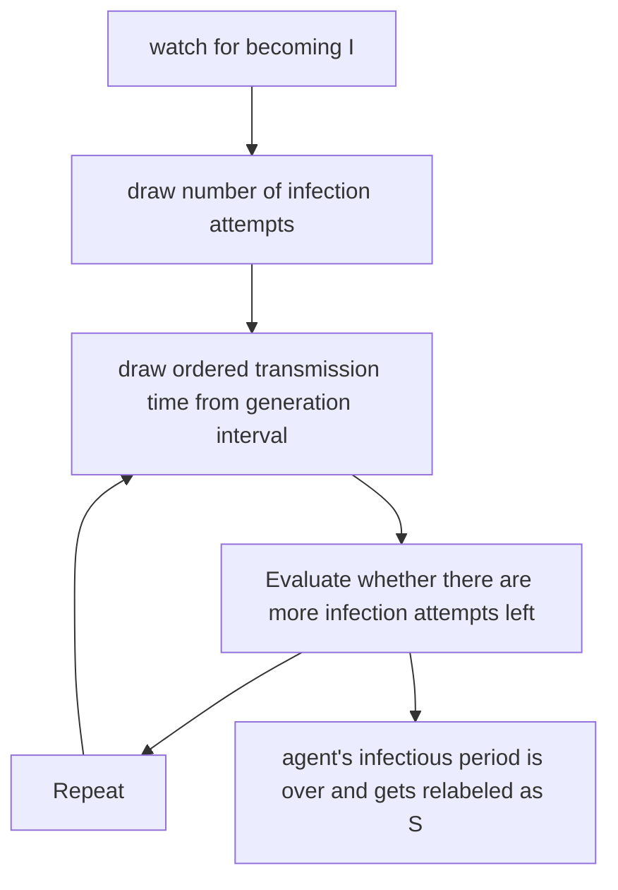
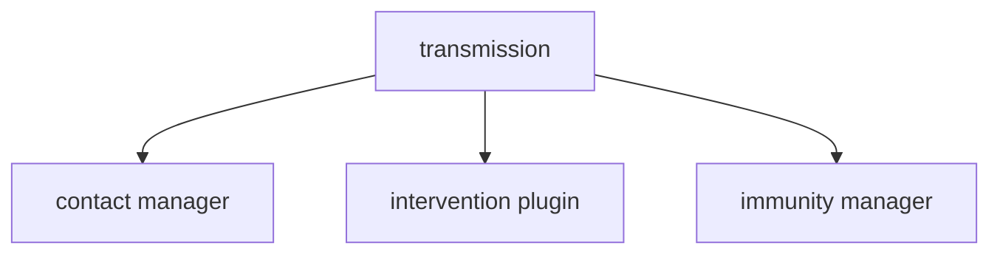

# Transmission model

## Overview

The transmission model controls person-to-person transmission between an
infectious agent and other susceptible agents. Agents become infectious immediately
upon successful infection attempt, though they may have a transmission probability of
0 for some time (mimicking an exposed compartment). Once infectious, agents have a pre-assigned
number of infection attempts. Infection attempt times are drawn from the generation interval.
Once there are no more infection attempts remaining for the agent, we model the agent as having
their level of immunity against the disease set to, say, 1 but have them transition back
to the susceptible compartment. This is to simplify the disease model and make it such that
immunity levels can be re-calculated when contacts are drawn rather than needing to update
them on a schedule.

## Workflow

The transmission model is centered around a key workflow:
1. Watch for an agent becoming infectious (S --> I transition).
2. For the infectious agent, draw a number of infection attempts. This could be from an $R_i$ distribution
or the distribution of the number of contacts an individual has based on their network connectivity.
There is also an option for each infection attempt to have a probability of transmission. This serves to
scale the contact distribution to a potential $R_i$ distribution.
3. Draw an infection time for the agent. This consists of taking an ordered draw from the generation
interval. The math for this is abstracted away under a generic `get_next_infection_time` method.
4. Draw a susceptible contact from the agent's contact group. Contacts could be drawn uniformly
from the contact group or with weight based on person characteristics. The actual
drawing of a contact can be abstracted into a `get_contact` method. Evaluate whether
the infection attempt is successful. Success is based on:
    - a potential probability of transmission in the case where we are drawing the
    number of contacts from a contact distribution,
    - whether any interventions are present that may reduce transmission,
    - the contact's immunity level which is updated when the contact is drawn.

    If the infection attempt is successful, the susceptible contact is labeled as infectious.
5. Repeat steps #3 and #4, decreasing the number of infection attempts left by one each time
regardless of whether the attempt is successful and ending when the agent has no zero
infection attempts remaining.
6. Re-label the agent as susceptible. Doing so will trigger the immunity manager to set the
agent's natural level of immunity to a value of immunity to mimic the agent being in
a recovered compartment. However, since we want the model to be general to consider waning
of immunity, labeling individuals as being in a recovered compartment where they have complete
immunity restricts the model's flexibility.

## Relationship to other managers/out of scope for the transmission manager

- The transmission manager does not implement interventions. It does not keep track
of interventions present or how they impact transmission.

- The transmission manager does not track an individual's contacts. Instead, the transmission
manager calls a generic method called `get_contact` which is in the `mod contact_manager` to obtain
the individual's contacts.

- The transmission manager does not track an individual's health status.

- The transmission manager does not track an individual's waning immunity over time. It can
interface with other methods that do calculate an individual's immunity -- for evaluating
whether a susceptible agent with partial immunity gets infected -- and the agent's natural
immunity level set at the end of their infectious period is done by that same immunity
manager.

## Diagram

Diagram of workflow:

Diagram of interactions:

